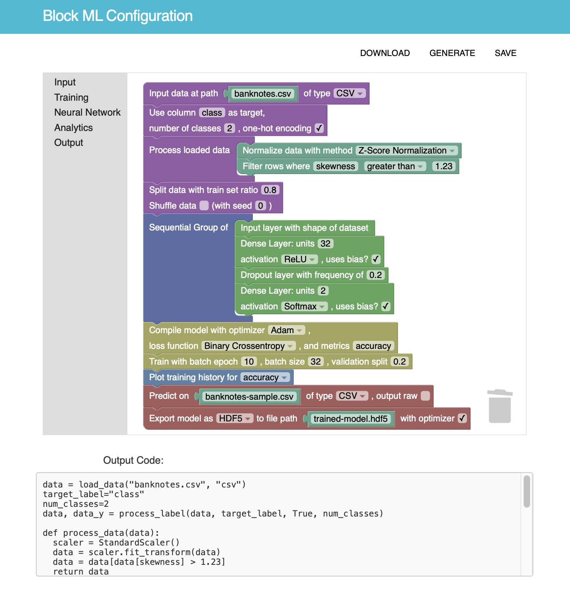

# Block ML -- build neural nets with blocks

Machine Learning shouldn't be limited to experienced software engineers, computer science majors, or other elites. It should be accessible to everyone, regardless of their background or knowledge in CS. Our goal is to empower individuals to design, build, and deploy ML models, enabling them to solve problems with creativity and innovation. This project is a prototype web app that caters to both researchers and business professionals seeking quick, low-cost ML solutions, and students eager to explore AI through a Scratch-like block programming interface. We aim to ignite passion for AI and technology across all levels of expertise.

## Features



- Drag and drop blocks to build powerful neural networks

  - Built-in functionalities to load and process data
  - A variety of analytics to choose from
  - Customizable parameter and architecture to suit your needs

- Automatic translation and supported helper-functions

  - Generated Jupyter Notebook can be easily downloaded
  - Integrates natively with other tensoflow applications
  - Built on NumPy, Pandas, Scikit-learn, Tensorflow Keras
  - Works with Google Colab for powerful and fast execution

- Multitude of output options for deployment or application

  - After training immediately make prediction of sample set
  - Export model / load trained model for future usage
  - Scalable with cloud computing technologies

## Guide to use

Our prototype web-app is built for quick deployment in mind so everyone can visualize and experiment with our idea! It takes less than 5 minutes to have the app running! Here are the steps after cloning the repo:

### Setup environment

Enable npm and dependent modules (as specified in package.json):

```
npm install
npx webpack
node server.js
```

### BlockML Editor

After opening the localhost address on your browser, select any of the Block ML workspaces available, _four in total_. Different blocks are presented on the menu bar to the left. Simply drag and drop them onto the editor and the code translation can be **viewed live** in the output text area below.

> TIP: You can quit the workspace and save your work in progress! This allows you to work on up to 4 different programs in one session!

### Exporting your design

Once you are satisfied with your program, click the "GENERATE" button to generate a Jupyter Notebook. Use the "DOWNLOAD" button to download locally. After that, we recommend uploading `blockml.ipynb` to Google Colab together with other required data files for training and execution.

## Developer Resources

We welcome contribution from everyone. However, you must be added as a collaborator of the repo to submit commits so please reach out to the project lead / owner first.

### Repository structure

```
block-ml/
│
├── build/ # autogenerated files, ignored by .gitignore
│
├── blocks/ # JSON files for block definitions
│
├── public/ # static files served by express + python header
│
├── src/ # javascript files bundled by webpack
│
└── README.md
```

### Links

- [Beginner intuitive tutorials for Google Blockly.][1]
- [Full Blockly Documentation.][2]
- [Documentation for Keras, the main machine learning package we use.][3]
- [Extensions and plugins that require support to develop!][4]

[1]: https://blocklycodelabs.dev
[2]: https://developers.google.com/blockly/guides/get-started/what-is-blockly
[3]: https://www.tensorflow.org/api_docs/python/tf/keras
[4]: https://google.github.io/blockly-samples/

### Other tips

**You would not be able to run anything without first enabling npm and dependent modules, see above.**

- During development the files are put under src/ for webpack to generate bundle.js in the public directory served by node.js
- You can make webpack recompile bundle.js automatically when a change is detected in the src/ folder using `npx webpack --watch`
- Nodemon can automatically restart the node.js server when changes are made to server-side files like server.js: `npx nodemon server.js`
